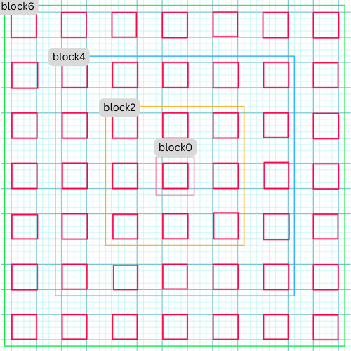
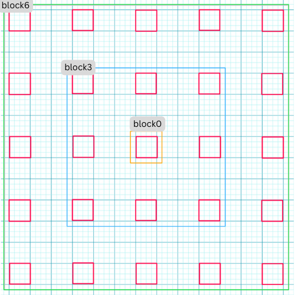

<p align="center">
  
</p>

**NB! `geoflutterfire3` is the revisited & improved version of [GeoFlutterFire](https://github.com/DarshanGowda0/GeoFlutterFire)**

### `GeoFlutterFire3` addresses the following issues of the original `GeoFlutterFire`:

- ~~range queries on multiple fields is not suppoerted by cloud_firestore at the moment, since this library already uses range query on `geohash` field, you cannot perform range queries with `GeoFireCollectionRef`.~~
  - `GeoFlutterFire3` now supports firestore range `startAt() | endAt()` queries!
- ~~`limit()` and `orderBy()` are not supported at the moment. `limit()` could be used to limit docs inside each hash individually which would result in running limit on all 9 hashes inside the specified radius. `orderBy()` is first run on `geohashes` in the library, hence appending `orderBy()` with another feild wouldn't produce expected results. Alternatively documents can be sorted on client side.~~
  - `GeoFlutterFire3` now supports firestore `limit()` and `orderBy()` queries!

>## What is GeoFlutterFire?
>
>GeoFlutterFire is an open-source library that allows you to store and query a set of keys based on their geographic location. At its heart, GeoFlutterFire simply stores locations with string keys. Its main benefit, however, is the possibility of retrieving only those keys within a given geographic area - all in realtime.
>
>GeoFlutterFire uses the Firebase Firestore Database for data storage, allowing query results to be updated in realtime as they change. GeoFlutterFire selectively loads only the data near certain locations, keeping your applications light and responsive, even with extremely large datasets.
>
>GeoFlutterFire is designed as a lightweight add-on to cloud_firestore plugin. To keep things simple, GeoFlutterFire stores data in its own format within your Firestore database. This allows your existing data format and Security Rules to remain unchanged while still providing you with an easy solution for geo-queries.
>
>Heavily influenced by [GeoFireX](https://github.com/codediodeio/geofirex) :fire::fire: from [Jeff Delaney](https://github.com/codediodeio) :sunglasses:

Quoted from [GeoFlutterFire](https://github.com/DarshanGowda0/GeoFlutterFire) \- Darshan Gowda


This package was developped in mist of the developement of [Swappers](https://play.google.com/store/apps/details?id=com.deepdev.swappers) for the [Global Gamers Challenge](https://www.bing.com/ck/a?!&&p=c198d06b8c575c29JmltdHM9MTcwOTk0MjQwMCZpZ3VpZD0wNTJhZDExYi1lMTRlLTZjM2YtM2I3YS1jMjJjZTBkYzZkNWUmaW5zaWQ9NTE5OQ&ptn=3&ver=2&hsh=3&fclid=052ad11b-e14e-6c3f-3b7a-c22ce0dc6d5e&psq=global+gamers+challenge&u=a1aHR0cHM6Ly9mbHV0dGVyLmRldi9nbG9iYWwtZ2FtZXJz&ntb=1), a mobile app that connects swappers around the world and allows them to swap items easily and safely.

## Getting Started

You should ensure that you add GeoFlutterFire as a dependency in your flutter project.

```yaml
dependencies:
  geoflutterfire3: <latest-version>
```

You can also reference the git repo directly if you want:

```yaml
dependencies:
  geoflutterfire3:
    git: git://github.com/AbderraoufKhodja/geoflutterfire3.git
```

You should then run `flutter pub get` or update your packages in IntelliJ.

## Initialize

You need a firebase project with [Firestore](https://pub.dartlang.org/packages/cloud_firestore) setup.

```dart
import 'package:geoflutterfire3/geoflutterfire3.dart';
import 'package:cloud_firestore/cloud_firestore.dart';

// Init firestore and geoFlutterFire
final geo = GeoFlutterFire();
final _firestore = FirebaseFirestore.instance;
```

## Why the need for GeoFlutterFire3?

GeoFlutterFire3 was developed to address some limitations and challenges faced with the previous versions of GeoFlutterFire. Here are some reasons why GeoFlutterFire3 is needed:

1. **Support for range `startAt() | endAt()` queries**: Previous versions of GeoFlutterFire did not support range queries. This meant that it was not possible to retrieve documents based on a range of values in a certain field. This limitation could significantly hinder the flexibility and efficiency of data retrieval. For instance, in a location-based application, the inability to perform range queries could make it difficult to find all entities within a certain time or numerical range, leading to inefficient workarounds and potentially poorer user experience.

2. **Support for firestore `limit()` and `orderBy()` queries**: Previous versions of GeoFlutterFire did not support firestore `limit()` and `orderBy()` query methods. This meant that it was not possible to limit the number of documents returned by a query or to order the documents based on a certain field. This limitation could significantly hinder the flexibility and efficiency of data retrieval. For instance, in a location-based application, the inability to limit the number of documents returned by a query or to order the documents based on a certain field could make it difficult to manage the data and lead to higher billing costs.

## How GeoFlutterFire3 models geo-queries with firestore?

In previous version of `GeoFlutterFire`, each document in firestore is logged with a single `geohash` field with a specific precision 0-8. When a geoquery is performed, the library basically makes a batch of 9 range ordered queries on the `geohash` field.

```dart
   query firestore documents based on geographic [radius] from geoFirePoint [center]
   [field] specifies the name of the key in the document
  Stream<List<DocumentSnapshot>> within({
    required GeoFirePoint center,
    required double radius,
    required String field,
    bool strictMode = false,
  }) {
    final precision = Util.setPrecision(radius);
    final centerHash = center.hash.substring(0, precision);
    final area = GeoFirePoint.neighborsOf(hash: centerHash)..add(centerHash);

    Iterable<Stream<List<DistanceDocSnapshot>>> queries = area.map((hash) {
      final tempQuery = _queryPoint(hash, field);
      return _createStream(tempQuery)!.map((QuerySnapshot querySnapshot) {
        return querySnapshot.docs.map((element) => DistanceDocSnapshot(element, null)).toList();
      });
    });
    // Rest of the code merges the queries
    ...
  }

  /// construct a query for the [geoHash] and [field]
  Query _queryPoint(String geoHash, String field) {
    final end = '$geoHash~';
    final temp = _collectionReference;
    return temp.orderBy('$field.geohash').startAt([geoHash]).endAt([end]);
  }
```

In `GeoFlutterFire3`, instead of logging each firestore document with a single `geohash` field, the library uses a different approach. ***It logs firestore documents with regions of geohash, meaning that each document is loaded with a center hash and a range of surrounding hashes corresponding to some specified distance around the center hash***. By doing so, we can retrieve documents in a specific range by the use of an `arrayContainsAny` query. This different in approach allows the library to support firestore range `startAt() | endAt()`, `limit()` and `orderBy()` queries.

## Writing Geo data

Add geo data to your firestore document using `GeoFirePoint`

```dart
GeoFirePoint myLocation = geo.point(latitude: 12.960632, longitude: 77.641603);
```

Next, add the GeoFirePoint to you document using Firestore's add method

```dart
 _firestore
        .collection('locations')
        .add({'name': 'random name', 'position': myLocation.regionalData()});
```

The `regionalData()` method in the `GeoFlutterFire3` library is designed to generate a map of geohashes around a central geopoint. This map includes the central geopoint and a set of surrounding geohashes, each truncated to a certain precision. The precision is determined by the number of characters from the geohash.

The method takes in five optional parameters of type `RegionMappingConfig`:

- `tinyRMC` corresponding to `precision8`, block size of 4.77m x 4.77m
- `smallRMC` corresponding to `precision6`, block size of 153m x 153m
- `mediumRMC` corresponding to `precision4`, block size of 4.89km x 4.89km
- `longRMC` corresponding to `precision2`, block size of 156km x 156km
- `hugeRMC` corresponding to `precision0`, block size of 5,000km x 5,000km

At least one of these parameters must be provided. If none is provided, an assertion error will be thrown. The `mediumRMC` parameter has a default value.

The method also accepts a boolean parameter `consoleLogMemoryUse`, which defaults to false. If set to true, the method will compute and print in the console (debug mode) the approximate memory usage of the returned data.

The returned map is structured as follows:

- The `geopoint` key contains the geopoint of the current instance.
- The `data` key contains another map. This inner map has keys in the format `precisionX`, where X is an index from 0 to 8. Each key corresponds to another map, This inner map has keys in the format 'blockY', where Y is an index starting from 0 and ending at the number of blocks specified in the `RegionMappingConfig` parameter. Each key corresponds to a list of neighboring hashes of the geopoint, truncated to a certain precision. Each list also includes the center hash `block0` of the geopoint truncated to the same precision.
  
The structure of data on firestore looks like this:

```
geopoint --> GeoPoint
data --> Map<String, Map>>
  |precision0 --> Map<String, List<String>
                block0 : List<String>
                block2 : List<String>
                  .
                  .
                  .

  |precision2 --> ...
  |precision4 --> ...
  |precision6 --> ...
  |precision8 --> ...
```

**Note:**
By default, the `regionalData()` method uses the `mediumRMC` parameter to generate the regional data. This corresponds to a precision of 4 and a block size of 4.89km x 4.89km. Other precision will not be included unless a `RegionMappingConfig` parameter is passed to the method to configure the desired precision. For example, to include all of them you can write:
```dart
    final cityGeoFirePoint = GeoFirePoint(cities[1].$1, cities[1].$2);
    final marseilleData = cityGeoFirePoint.regionalData(
        logMemoryUse: true,
      tinyRMC: RegionMappingConfig(
        blockSpacing: BlockSpacing.two,
        numBlocks: 12),
      smallRMC: RegionMappingConfig(
        blockSpacing: BlockSpacing.three,
        numBlocks: 5),
      mediumRMC: RegionMappingConfig(
        blockSpacing: BlockSpacing.five,
        numBlocks: 5),
      longRMC: RegionMappingConfig(
        blockSpacing: BlockSpacing.one,
        numBlocks: 3),
      hugeRMC: RegionMappingConfig(
        blockSpacing: BlockSpacing.one,
        numBlocks: 8),
    );
  ```
  
## Configuring The Region Mapping

`RegionMappingConfig` is a configuration class for mapping a region in GeoFlutterFire3. This class is used to define the region size and the spacing interval between blocks for a region around a geopoint. The region can be represented as a grid in a 2D plane, with each block (or cell) corresponding to a geohash.

Properties:
- `blockSpacing`: The index multiplier to which a geohash is saved. It is an instance of `BlockSpacing` enum.
   The default value is `BlockSpacing.five`, which corresponds an interval of 4 blocks.
- `numSpacedBlock`: The number of blocks to include in the data. The default value is 12.

Example usage:

```dart
   final cityGeoFirePoint = GeoFirePoint(36.7525, 3.0420);
   final marseilleData = cityGeoFirePoint.regionalData(
      consoleLogMemoryUse: true,
     mediumRMC: RegionMappingConfig(blockSpacing: BlockSpacing.three, numBlocks: 12),
   );
```

The `blockSpacing` property determines the interval at which geohashes are selected from the grid. A smaller `blockSpacing` results in more geohashes being selected, as a geohash is picked at each `blockSpacing` index multiplier, which allows for more precise queries but at the cost of a larger data size and more memory usage. Conversely, a larger `blockSpacing` results in fewer geohashes being selected, as they are more widely spaced apart on the grid. Which reduces the data size and memory usage, but at the cost of less precise queries.

The `numSpacedBlock` property determines the number of spaced blocks to include in the region. A larger `numSpacedBlock` value results in a larger region, as more blocks are included. Which allows for longer range queries, but also at the expense of a larger data size and more memory usage.
Conversely, a smaller `numSpacedBlock` value results in a smaller region, as fewer blocks are included with less memory usage and shorter range queries.

Here's a visual example of how the `RegionMappingConfig` works with `blockSpacing = BlockSpacing.two` and `numSpacedBlock = 4`.



The data field will look like this:

```
data --> Map<String, Map>
  |precision4 --> Map<String, List<String>
                block0 : List<String>
                block2 : List<String>
                block4 : List<String>
                block6 : List<String>
```

Here's a visual example of how the `RegionMappingConfig` might work with `blockSpacing = BlockSpacing.three` and `numSpacedBlock = 3`.




The data field will look like this:

```
geopoint --> GeoPoint
data --> Map<String, Map>
  |precision4 --> Map<String, List<String>
                block0 : List<String>
                block3 : List<String>
                block6 : List<String>
```

**Note:**
- The `regionalData()` method is designed to be used with the `within()` method of the `GeoFlutterFire3` library. It is not intended to be used with the `where()` method of the `cloud_firestore` library.

<!-- // TODO: find an other place for this
Calling `geoFirePoint.regionalData()` returns an object that contains a [geohash string](https://www.movable-type.co.uk/scripts/geohash.html) and a [Firestore GeoPoint](https://firebase.google.com/docs/reference/android/com/google/firebase/firestore/GeoPoint). It should look like this in your database. You can name the object whatever you want and even save multiple points on a single document. -->

## Query Geo data

To query a collection of documents with 50kms from a point

```dart
// Create a geoFirePoint
final center = geo.point(latitude: 12.960632, longitude: 77.641603);

// get the collection reference or query
final collectionReference = _firestore.collection('locations');

final radius = 50;
final field = 'position';

final stream = geo.collection(collectionRef: collectionReference)
                                        .within(center: center, radius: radius, field: field);
```

The within function returns a Stream of the list of DocumentSnapshot data, plus some useful metadata like distance from the centerpoint.

```dart
stream.listen((List<DocumentSnapshot> documentList) {
        // doSomething()
      });
```

You now have a realtime stream of data to visualize on a map.


## :notebook: API

### `collection(collectionRef: CollectionReference)`

Creates a GeoCollectionRef which can be used to make geo queries, alternatively can also be used to write data just like firestore's add / set functionality.

Example:

```dart
// Collection ref
// var collectionReference = _firestore.collection('locations').where('city', isEqualTo: 'bangalore');
final collectionReference = _firestore.collection('locations');
final geoRef = geo.collection(collectionRef: collectionReference);
```

Note: collectionReference can be of type CollectionReference or Query

#### Performing Geo-Queries

```dart
geoRef.within(
  center: GeoFirePoint,
  radius: double,
  field: String)
```
<!-- ```dart
geoRef.within(
  center: GeoFirePoint,
  radius: double,
  field: String,
  {strictMode: bool})
``` -->

Query the parent Firestore collection by geographic distance. It will return documents that exist within X kilometers of the center-point.
`field` supports nested objects in the firestore document.

<!-- **Note:** Use optional parameter `strictMode = true` to filter the documents strictly within the bound of given radius. -->

Example:

```dart
// For GeoFirePoint stored at the root of the firestore document
geoRef.within(center: centerGeoPoint, radius: 50, field: 'position');

// For GeoFirePoint nested in other objects of the firestore document
geoRef.within(center: centerGeoPoint, radius: 50, field: 'address.location.position');
```

Each `documentSnapshot.data()` also contains `distance` calculated on the query.

**Returns:** `Stream<List<DocumentSnapshot>>`

#### Write Data

Write data just like you would in Firestore

`geoRef.add(data)`

Or use one of the client's convenience methods

- `geoRef.setDoc(String id, var data, {bool merge})` - Set a document in the collection with an ID.
- `geoRef.setPoint(String id, String field, double latitude, double longitude)`- Add a geohash to an existing doc

#### Read Data

In addition to Geo-Queries, you can also read the collection like you would normally in Firestore, but as an Observable

- `geoRef.data()`- Stream of documentSnapshot
- `geoRef.snapshot()`- Stream of Firestore QuerySnapshot

### `point(latitude: double, longitude: double)`

Returns a GeoFirePoint allowing you to create geohashes, format data, and calculate relative distance.

Example:

```dart
dart final point = geo.point(38, -119)
```

#### Getters

- `point.hash` Returns a geohash string at precision 9
- `point.geoPoint` Returns a Firestore GeoPoint

#### Geo Calculations

- `point.distance(latitude, longitude)` Haversine distance to a point

<!-- ## :zap: Tips

### Scale to Massive Collections

It's possible to build Firestore collections with billions of documents. One of the main motivations of this project was to make geoqueries possible on a queried subset of data. You can pass a Query instead of a CollectionReference into the collection(), then all geoqueries will be scoped with the constraints of that query.

Note: This query requires a composite index, which you will be prompted to create with an error from Firestore on the first request.

Example:

```dart
var queryRef = _firestore.collection('locations').where('city', isEqualTo: 'bangalore');
var stream = geo
              .collection(collectionRef: queryRef)
              .within(center: center, radius: rad, field: 'position');
``` -->

<!-- ### Usage of strictMode

It's advisable to use `strictMode = false` for smaller radius to make use of documents from neighbouring hashes as well.

As the radius increases to a large number, the neighbouring hash precisions fetch documents which would be considerably far from the radius bounds, hence its advisable to use `strictMode = true` for larger radius.

**Note:** filtering for strictMode happens on client side, hence filtering at larger radius is at the expense of making unnecessary document reads. -->

<!-- ### Make Dynamic Queries the RxDart Way

```dart
var radius = BehaviorSubject<double>.seeded(1.0);
var collectionReference = _firestore.collection('locations');

stream = radius.switchMap((rad) {
      return geo
          .collection(collectionRef: collectionReference)
          .within(center: center, radius: rad, field: 'position');
    });

// Now update your query
radius.add(25);
``` -->

### Acknowledgements  
**NB! `geoflutterfire3` is a revisited and updated version of [GeoFlutterFire](https://github.com/DarshanGowda0/GeoFlutterFire)**  
The work originates from [GeoFlutterFire](https://github.com/DarshanGowda0/GeoFlutterFire) by Darshan Narayanaswamy 